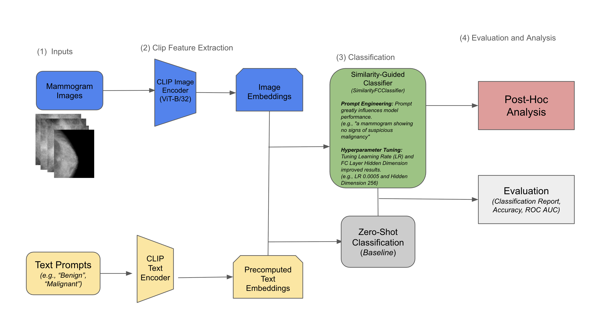

# Breast Cancer Malignancy Classification using CLIP

## Overview

This project focuses on building and evaluating a vision-language model for classifying breast cancer malignancy from mammograms. It uses the pre-trained **CLIP** model (`ViT-B/32`) to extract frozen visual features, which are then applied to a medical imaging classification task.

A custom classification head, called **SimilarityFCClassifier**, was developed and trained using a novel approach: instead of relying solely on traditional labels, training was guided by the similarity between image embeddings and descriptive text prompts. This involved iterative prompt engineering and hyperparameter tuning to optimize performance.

## Results

- **Test Accuracy**: 72.2%  
- **ROC AUC**: 0.788

These results demonstrate that the similarity-guided method significantly outperforms both baseline and zero-shot approaches. 

## Project Structure

This section provides an overview of the steps involved in developing a CLIP-based classifier for mammogram image analysis using a similarity-guided approach. It includes data handling, feature extraction, model training, evaluation, and post-hoc analysis.

### 1. Setup and Preprocessing
- Mount storage and verify file structure
- Load and clean metadata from CSV files
- Correct image paths and map them to unique identifiers
- Visualize sample mammogram images for verification

### 2. Feature Extraction with CLIP
- Load the pre-trained CLIP model (`ViT-B/32`) and processor
- Split the dataset into training, validation, and test sets
- Extract fixed image embeddings using the CLIP encoder

### 3. Similarity-Guided Classification
- Precompute text embeddings from descriptive class prompts
- Train a custom classifier to align image and text representations
- Evaluate performance using accuracy and ROC AUC metrics

### 4. Zero-Shot Classification
- Classify images using only text prompts (no model training)
- Establish a baseline for comparison with the trained model

### 5. Post-Hoc Analysis
- **Metadata Evaluation**: Identify trends or errors based on image metadata
- **Threshold Adjustment**: Analyze the impact of changing classification thresholds on false positives and false negatives
